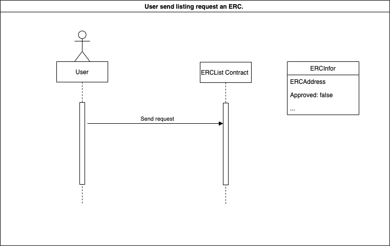
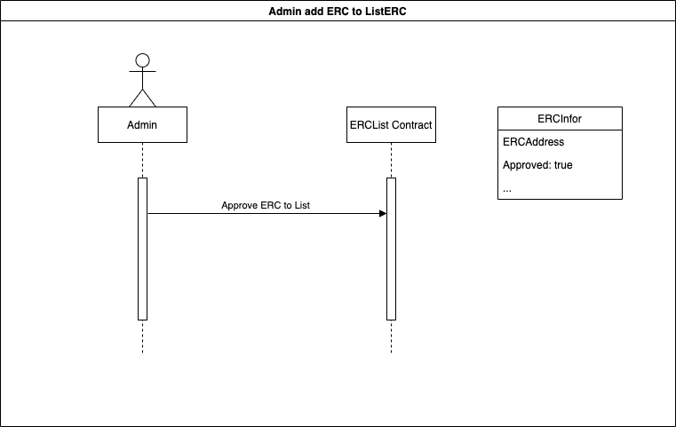
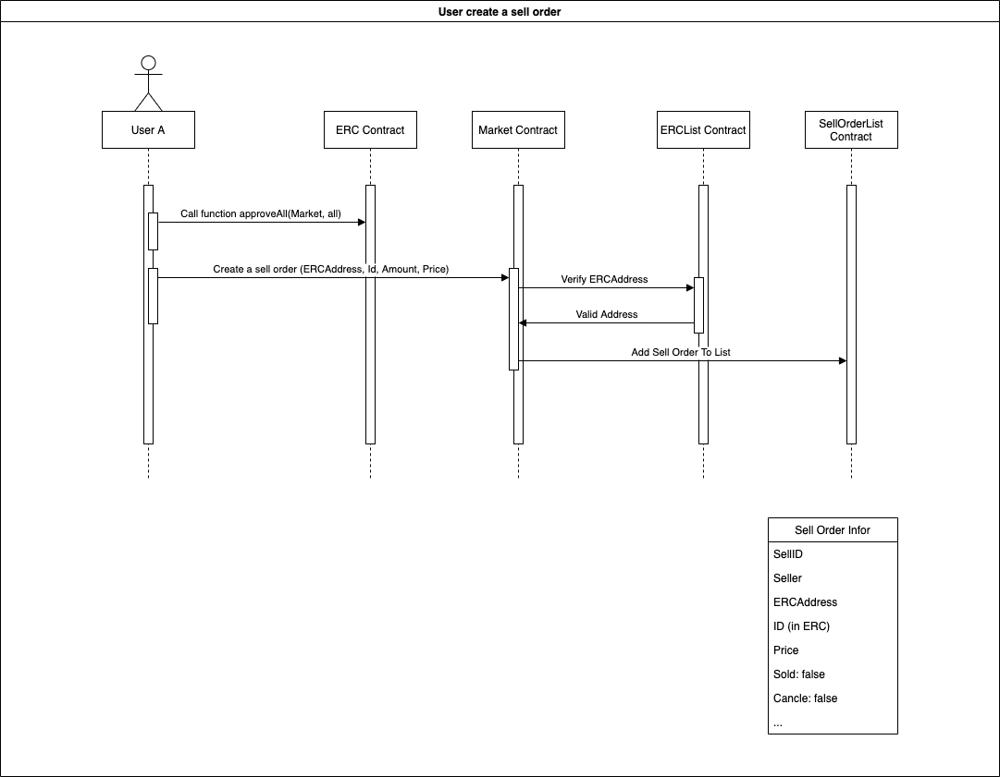
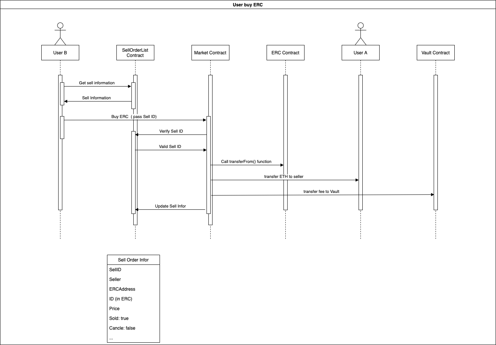
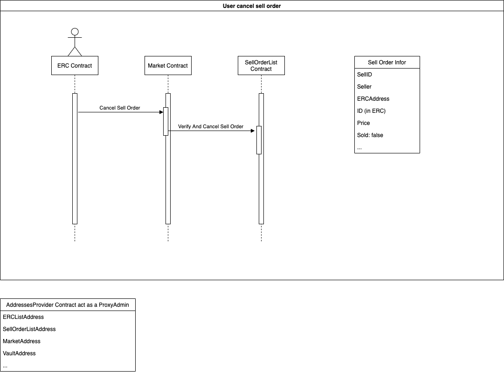
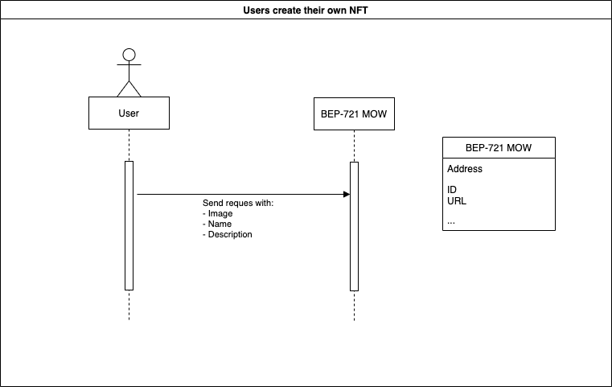
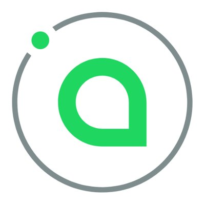

<h1 align="center">Welcome to MOW Market 🐮</h1>

  

## Introduction 👋

The platform allows blockchain users to create, sell or collect NFT

## Live Project 🚀

https://mow-market-275c5.web.app/

## Video demo

## Contract (BSC Testnet)

**AddressesProvider**: '0x61c8C967b54118d3310A24f0D4c1aA4A51bA11A4'

**NftList**: '0x8717b0243ADaB85213f002F062dD43ef48647CfB'

**Vault**: '0x672a1AE943b870184644d0b36A1a210AffDcb984'

**SellOrderList**: '0xf6901a458Def0F2C94C47947a2016F782F2ea2ba'

**Market**: '0xb4C087DF69Cf9A54B5FA0b47B59Bd6b46266579B'

**MOW-NFT**: '0xEB8894de49349b9dfe804d43BFe988F483EaB5e7'

## Roadmap ⛳

### 📌 Phase 1:

- [Admin] List NFT contract address -> **BEP-1155**, **BEP-721**
- Login
- Sell NFT with fixed price
- Buy NFT with fixed price
- My page: list all my NFT assets
- Browse page: buy NFT assets

### Phase 2:

- Let user create their own NFT assets right on UI
- Implement aution style (bid/ask) NFT market
- Improve UI:
  - Sort NFT by categories
  - Show activity -> transfer, bid, sales, listing
  - Show NFT leaderboard -> volume, avg price

### Phase 3:

- Improve UX by reduce user's approve & sign transactions.
- NFT lending/borrowing/farming.

**Future:**

- Swap NFT between chains (**Ethereum** and **Binance smart chain**)

## Sequence Diagram

- Users create request for new NFT contract address:
  
- Admin accepts listing requests for new NFT contract address:
  
- Users create orders when selling their NFT
  
- Users create transactions to buy the NFTs being offered for sale
  
- The owners of the NFTs can cancel the sell orders if they no longer want to sell
  
- Users can create their own NFT with MOW:
  

## Technical 🤖

- Frontend: Using **Reactjs**, **Redux thunk**

  

- Storage: Using **3Box** (https://github.com/3box/3box) for user's profile, **Sia** for NFT's storage:

  
  

- Smart contract: Using solidity version 0.6.12 and **Upgradable Proxy Contracts**.
